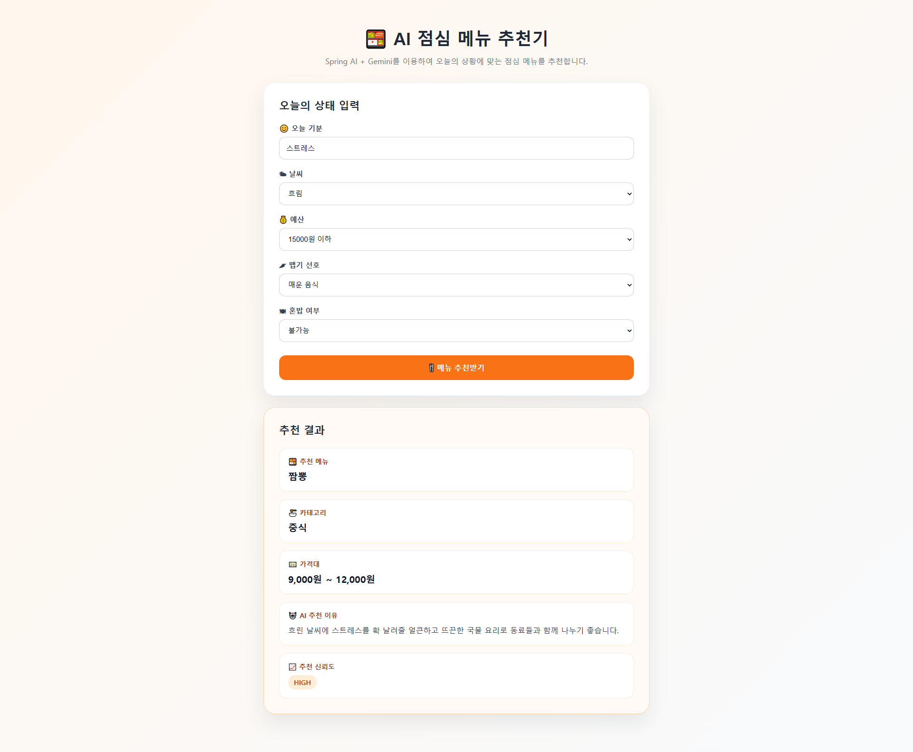

# 🍱 AI Lunch Menu Recommender

Spring AI와 Gemini를 활용하여 사용자의 현재 상황에 맞는 점심 메뉴를 추천하는 웹 애플리케이션입니다.

---

## 📌 프로젝트 소개

사용자가 오늘의 기분, 날씨, 예산, 맵기 선호, 혼밥 여부를 입력하면
Spring AI의 Prompt Template과 Structured Output 기능을 이용하여
AI가 적절한 점심 메뉴를 추천합니다.

---

## ✨ 주요 기능

- 🍱 AI 점심 메뉴 추천
- 🌤 날씨, 기분, 예산 기반 추천
- 📋 Structured Output(Java Record) 활용
- 📊 추천 신뢰도(Confidence) 표시
- 🎨 Confidence에 따른 색상 변경

---

## 🛠 Tech Stack

### Backend

- Java 21
- Spring Boot
- Spring AI
- Gemini API

### Frontend

- HTML5
- CSS3
- JavaScript (Fetch API)

---

## 📂 프로젝트 구조

```text
src
├── main
│   ├── java
│   │   └── com.study.day2promptoutput
│   │       ├── ClassifyController.java
│   │       ├── ClassifyService.java
│   │       └── dto
│   │           └── MenuRecommendation.java
│   │
│   └── resources
│       ├── static
│       │   ├── index.html
│       │   ├── css
│       │   │   └── style.css
│       │   └── js
│       │       └── app.js
│       │
│       └── application.properties
```

---

## ⚙️ 동작 과정

```text
사용자 입력
        │
        ▼
Fetch API
        │
        ▼
GET /api/menu
        │
        ▼
ClassifyController
        │
        ▼
ClassifyService
        │
        ▼
Prompt Template
        │
        ▼
Gemini
        │
        ▼
Structured Output
        │
        ▼
MenuRecommendation Record
        │
        ▼
JSON 응답
        │
        ▼
웹 화면 출력
```

---

## 📝 Prompt Template

입력 정보

- 😊 오늘 기분
- 🌤 날씨
- 💰 예산
- 🌶 맵기 선호
- 🍽 혼밥 여부

출력 정보

- 🍱 추천 메뉴
- 🍜 카테고리
- 💵 가격대
- 🤖 추천 이유
- 📈 추천 신뢰도

---

## 📷 실행 화면

<p align="center">
    
</p>


---

## 📖 학습 내용

- PromptTemplate 활용
- Structured Output
- Java Record 매핑
- ChatClient 사용
- Fetch API 연동
- HTML / CSS / JavaScript를 이용한 화면 구현

---

## 🚀 실행 방법

```bash
git clone https://github.com/narxkim/spring-assignment.git

cd 프로젝트명
```

```bash
./gradlew bootRun
```

브라우저 접속

```
http://localhost:8080
```

---

## 📚 사용 API

- Google Gemini
- Spring AI ChatClient
