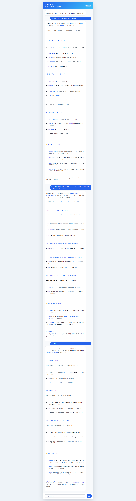

# ✈️ AI Travel Planner

Spring AI의 **Advisor**와 **Chat Memory**를 활용하여 구현한 AI 여행 플래너입니다.

사용자의 여행 조건을 기억하며 대화를 이어가고, **H2 Database**를 이용해 서버를 재시작해도 이전 대화를 유지하는 여행 챗봇입니다.

---

## Preview

> 실행 화면

<!-- 이미지 추가 -->


---

# Tech Stack

- Java 21
- Spring Boot
- Spring AI
- Google Gemini
- H2 Database
- HTML / CSS / JavaScript

---

# Features

## 여행 일정 추천

여행지, 여행 기간, 예산 등을 입력하면 AI가 여행 일정을 추천합니다.

### 예시

```text
👤 부산 2박 3일 여행 추천해줘

↓

🤖
📍 여행 요약
🗓️ 추천 일정
🍽️ 추천 맛집
💰 예상 비용
```

---

## Chat Memory

사용자의 이전 대화를 기억하여 이어서 답변합니다.

```text
👤 부산 여행 갈래

↓

👤 예산은 30만원이야

↓

👤 내가 어디 여행 간다고 했지?

↓

🤖
부산 여행이라고 말씀하셨습니다.
```

---

## Persistent Memory (H2)

JdbcChatMemoryRepository를 사용하여 대화를 데이터베이스에 저장합니다.

```text
사용자

↓

MessageChatMemoryAdvisor

↓

JdbcChatMemoryRepository

↓

H2 Database
```

서버를 재시작해도 같은 Conversation ID를 사용하면 이전 대화를 기억합니다.

---

## Advisor

본 프로젝트에서는 Spring AI Advisor를 활용하여 공통 기능을 분리했습니다.

### MaxCharLengthAdvisor

답변 길이를 제한합니다.

---

### SafeGuardAdvisor

민감한 키워드를 차단합니다.

예시

```text
폭탄

계좌번호

테러
```

---

### CallCounterAdvisor

LLM 호출 횟수를 카운트합니다.

---

### SimpleLoggerAdvisor

요청과 응답을 로그로 출력합니다.

---

# Project Structure

```text
src
├── advisor
│   ├── CallCounterAdvisor
│   └── MaxCharLengthAdvisor
│
├── config
│   └── ChatMemoryConfig
│
├── controller
│   └── TravelController
│
├── service
│   ├── TravelPlannerService
│   ├── MemoryTravelService
│   └── PersistentChatService
│
└── resources
    └── static
        ├── index.html
        ├── travel.css
        └── travel.js
```

---

# API

| Method | URL | Description |
|---------|-----|-------------|
| GET | /api/travel-chat | 일반 여행 추천 |
| GET | /api/travel-memory | In-Memory Chat |
| GET | /api/travel-persistent | H2 Persistent Chat |

---

# Chat Memory Flow

```text
사용자

↓

MessageChatMemoryAdvisor

↓

ChatMemory

↓

JdbcChatMemoryRepository

↓

H2 Database

↓

LLM

↓

응답
```

---

# 실행 방법

### 환경 변수

```
GOOGLE_API_KEY=YOUR_API_KEY
```

### 실행

```
./gradlew bootRun
```

브라우저

```
http://localhost:8080
```

---

# Test Scenario

### Step 1

```
경주 당일치기 여행 추천해줘
```

### Step 2

```
예산은 5만원이야
```

### Step 3

```
내가 어디 여행 간다고 했지?
```

Memory가 정상 동작하면 이전 여행 정보를 기억합니다.

---

# What I Learned

- Spring AI ChatClient
- Advisor Pattern
- Custom Advisor 구현
- MessageChatMemoryAdvisor
- In-Memory Chat Memory
- JdbcChatMemoryRepository
- H2 Database
- Conversation ID 관리
- AI Chat UI 구현

---

# Future Improvements

- 여행 이미지 추천
- Google Maps API 연동
- 호텔 및 맛집 검색
- 날씨 기반 여행 일정 추천
- 여행 일정 PDF 생성