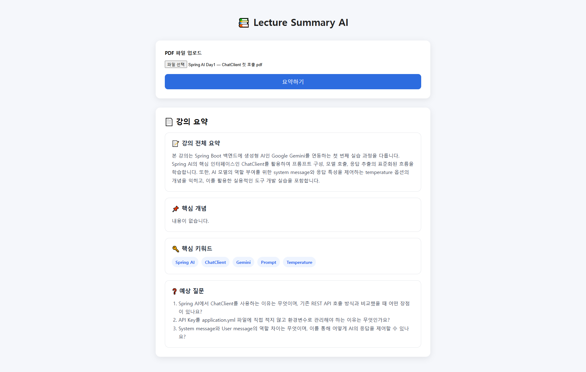

# 📚 Lecture Summary AI

Spring AI의 **Multimodal(PDF)** 기능을 활용하여 강의자료를 업로드하면 AI가 내용을 분석하고 요약해주는 웹 애플리케이션입니다.

---

## ✨ Features

- 📄 PDF 파일 업로드
- 📝 강의 내용 요약
- 📌 핵심 개념 추출
- 🔑 핵심 키워드 추출
- ❓ 예상 질문 생성
- 💬 Chat Memory 기반 대화 유지

---

## 🛠 Tech Stack

| Category | Technology |
|----------|------------|
| **Language** | Java 21 |
| **Framework** | Spring Boot 4.1.0 |
| **AI Framework** | Spring AI 2.0.0 |
| **LLM** | Google Gemini 3.1 Flash Lite |
| **Template Engine** | Thymeleaf |
| **Frontend** | HTML5 · CSS3 · JavaScript |
| **Build Tool** | Gradle |
| **Development Tools** | Lombok · Spring Boot DevTools |

---

## 📂 Project Structure

```text
day4-multimodal
│
├── controller
│   └── LectureSummaryController
│
├── dto
│   └── LectureSummary
│
├── service
│   └── LectureSummaryService
│
├── config
│   └── ChatMemoryConfig
│
└── resources
    ├── templates
    │   └── index.html
    └── static
        ├── css
        │   └── style.css
        └── js
            └── script.js
```

---

## 🔄 Workflow


---

## 📸 Preview

> 실행 화면

<!-- 이미지 추가 -->


---

## 📋 Output Example

### 📝 강의 전체 요약

- Spring AI의 Multimodal 기능을 활용하여 PDF를 분석하고 요약합니다.

### 📌 핵심 개념

- Spring AI
- ChatClient
- MultipartFile
- Media
- Chat Memory

### 🔑 핵심 키워드

- Spring AI
- Gemini
- PDF
- Multimodal
- ChatClient

### ❓ 예상 질문

1. Spring AI의 Multimodal이란 무엇인가?
2. Chat Memory의 역할은 무엇인가?
3. MultipartFile을 사용하는 이유는 무엇인가?

---

## 🚀 How to Run

### 1. 환경 변수 설정

```text
GOOGLE_API_KEY=YOUR_API_KEY
```

### 2. 프로젝트 실행

```bash
./gradlew bootRun
```

또는 IntelliJ에서 `Day4MultimodalApplication`을 실행합니다.

### 3. 브라우저 접속

```text
http://localhost:8080
```

---

## 💡 Learning Points

- Spring AI ChatClient 활용
- Multimodal PDF 입력 처리
- Chat Memory 적용
- Structured Output (`.entity()`)
- MultipartFile 처리
- ByteArrayResource 변환
- MIME Type 설정