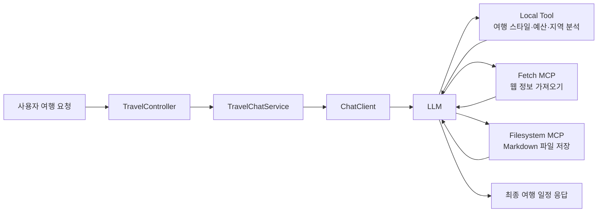

아래 내용 그대로 `README.md`에 넣으면 돼.

````markdown
# 🧳 MCP AI Travel Planner

Spring AI의 Tool Calling, MCP, Chat Memory를 활용한 AI 여행 플래너 프로젝트입니다.

사용자가 자연어로 여행 조건을 입력하면 AI가 여행 스타일, 예산, 지역 정보를 분석하고, 필요한 경우 웹 정보를 참고하거나 여행 일정을 Markdown 파일로 저장합니다.

---

## 주요 기능

### 1. AI 여행 일정 생성

사용자가 입력한 조건을 바탕으로 여행 일정을 생성합니다.

예시 입력:

```text
부산 1박 2일 힐링 여행 일정을 추천해줘.
예산은 15만원이고 대중교통으로 이동할 거야.
````

---

### 2. Local Tool Calling

프로젝트 내부에서 직접 정의한 Tool을 사용합니다.

| Tool                  | 역할           |
| --------------------- | ------------ |
| TravelPreferenceTools | 여행 스타일 분석    |
| BudgetTools           | 예산 수준 분석     |
| LocalAreaTools        | 지역별 추천 장소 제공 |

---

### 3. MCP Filesystem

생성된 여행 일정을 `mcp-sandbox` 폴더 안에 Markdown 파일로 저장할 수 있습니다.

예시 입력:

```text
방금 만든 여행 일정을 busan-trip-plan.md 파일로 저장해줘.
```

---

### 4. MCP Fetch

사용자가 URL을 입력하면 해당 웹 페이지 내용을 가져와 여행 일정에 반영합니다.

예시 입력:

```text
https://www.visitbusan.net 내용을 참고해서 부산 여행 일정을 추천해줘.
```

---

### 5. Chat Memory

InMemory 방식의 Chat Memory를 적용했습니다.

이전 대화의 여행 조건을 기억하여 후속 요청에 반영합니다.

예시:

```text
부산 1박 2일 힐링 여행 추천해줘.
```

이후:

```text
둘째 날만 맛집 위주로 수정해줘.
```

---

## 기술 스택

| 구분              | 기술                     |
| --------------- | ---------------------- |
| Backend         | Spring Boot            |
| AI              | Spring AI              |
| Model           | Google Gemini          |
| Tool Calling    | Spring AI Tool Calling |
| MCP             | MCP Client             |
| View            | Thymeleaf              |
| Frontend        | HTML, CSS, JavaScript  |
| Memory          | InMemory Chat Memory   |
| Package Manager | Gradle                 |

---

## 프로젝트 구조

```text
src/main/java/com/study/day5toolmcp
├── config
│   └── ChatMemoryConfig.java
│
├── controller
│   └── TravelController.java
│
├── mcp
│   └── McpToolCatalog.java
│
├── service
│   └── TravelChatService.java
│
├── tool
│   ├── TravelPreferenceTools.java
│   ├── BudgetTools.java
│   └── LocalAreaTools.java
│
└── Day5ToolMcpApplication.java
```

```text
src/main/resources
├── templates
│   └── index.html
│
└── static
    ├── css
    │   └── style.css
    └── js
        └── app.js
```

---

## 실행 전 준비

### 1. API Key 설정

환경변수에 Google Gemini API Key를 등록합니다.

```bash
GOOGLE_API_KEY=your_api_key
```

---

### 2. MCP 실행 도구 확인

Filesystem MCP는 `npx`를 사용합니다.

```bash
npx --version
```

Fetch MCP는 `uvx`를 사용합니다.

```bash
uv --version
uvx --version
```

---

## application.yml 예시

```yaml
spring:
  application:
    name: day5-tool-mcp

  ai:
    google:
      genai:
        api-key: ${GOOGLE_API_KEY}
        chat:
          model: gemini-3.1-flash-lite
          temperature: 0.7

    mcp:
      client:
        request-timeout: 60s
        stdio:
          connections:
            filesystem:
              command: npx.cmd
              args:
                - "-y"
                - "@modelcontextprotocol/server-filesystem"
                - "${user.dir}/mcp-sandbox"

            fetch:
              command: uvx
              args:
                - "mcp-server-fetch"

server:
  error:
    include-message: always
```

---

## 실행 방법

```bash
./gradlew bootRun
```

Windows에서는:

```bash
gradlew.bat bootRun
```

브라우저 접속:

```text
http://localhost:8080
```

---

## 테스트 시나리오

### 1. 기본 여행 일정 생성

```text
부산 1박 2일 힐링 여행 일정을 추천해줘.
예산은 15만원이고 대중교통으로 이동할 거야.
```

---

### 2. Chat Memory 확인

```text
둘째 날만 맛집 위주로 수정해줘.
```

---

### 3. Filesystem MCP 확인

```text
방금 수정한 여행 일정을 busan-memory-test-trip.md 파일로 저장해줘.
```

확인 위치:

```text
mcp-sandbox/busan-memory-test-trip.md
```

---

### 4. Fetch MCP 확인

```text
https://www.visitbusan.net 페이지 내용을 참고해서 부산 여행 일정에 반영해줘.
그리고 busan-fetch-trip-plan.md 파일로 저장해줘.
```

---

## 핵심 동작 흐름



---

## 구현 포인트

### Tool Calling

LLM이 직접 기능을 실행하지 않고, 필요한 Tool 호출을 요청합니다.

실제 실행은 Spring 애플리케이션이 담당합니다.

---

### MCP

외부 MCP 서버를 통해 파일 저장과 웹 정보 가져오기 기능을 사용합니다.

| MCP        | 역할            |
| ---------- | ------------- |
| filesystem | 파일 읽기/쓰기      |
| fetch      | 웹 페이지 내용 가져오기 |

---

### Chat Memory

사용자의 이전 여행 조건을 기억하여 후속 요청에 반영합니다.

이번 프로젝트에서는 간단한 실습을 위해 InMemory 방식을 사용했습니다.

---

## 학습 포인트

* Spring AI ChatClient 사용
* Local `@Tool` 정의
* `@ToolParam`을 활용한 Tool 입력 설명
* record 기반 Tool 반환값 구성
* MCP Client 연결
* filesystem MCP를 이용한 파일 저장
* fetch MCP를 이용한 웹 정보 활용
* Chat Memory를 통한 대화 맥락 유지
* Thymeleaf 기반 간단한 채팅 UI 구현

---

## 결과

이 프로젝트는 단순한 여행 추천 챗봇이 아니라, Tool Calling과 MCP를 활용해 실제로 웹 정보를 가져오고 파일을 저장할 수 있는 AI Agent 형태의 여행 플래너입니다.

```
```
